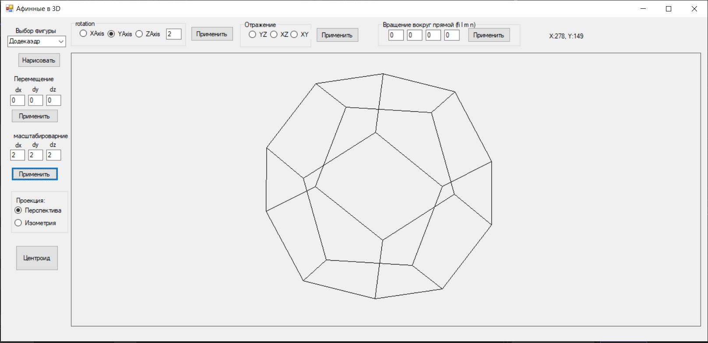
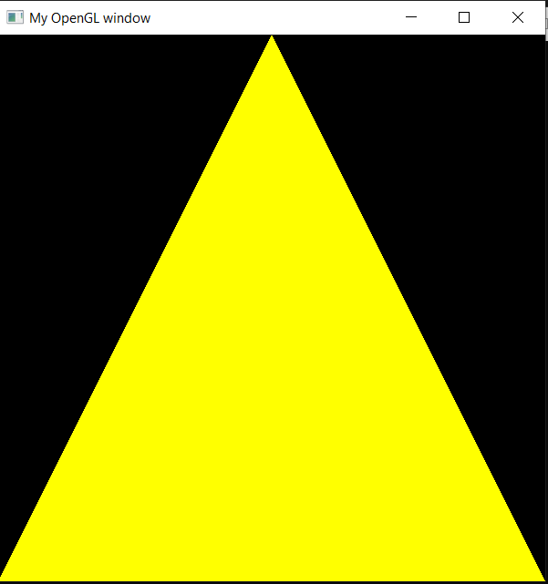

# Graphics Labs Repository

- [Lab1.](./lab1/) Working in graphical mode
- [Lab2.](./Lab2/) Color spaces. Transformation of color spaces
- [Lab3.](./lab3/) Raster algorithms
- [Lab4.](./Lab4/) Affine transformations on the plane and auxiliary algorithms Task 
- [Lab5.](./Lab5/) L-systems. The midpoint displacement algorithm. Bezier curves
- [Lab6.](./Lab6/) Affine transformations in space. Projection
- [Lab7.](./Lab7/) building three-dimensional models
- [Lab10.](./lab10/) The Green Triangle
- [Lab11.](./lab11/) construction of various 2D shapes. Flat and gradient painting. Uniform and A tribute Assignment

# Lab6: Affine transformations program interface 

# Lab 10 Triangle(not green :) )
